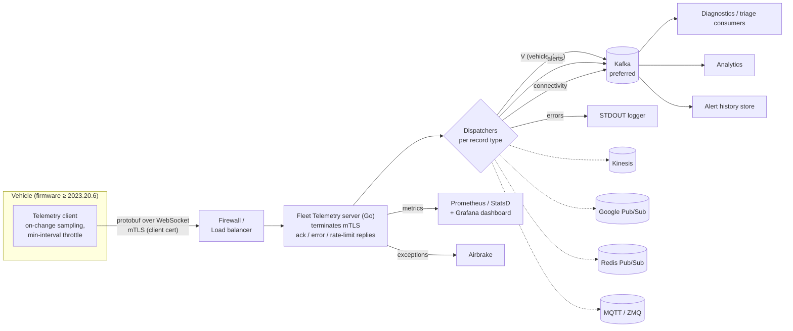
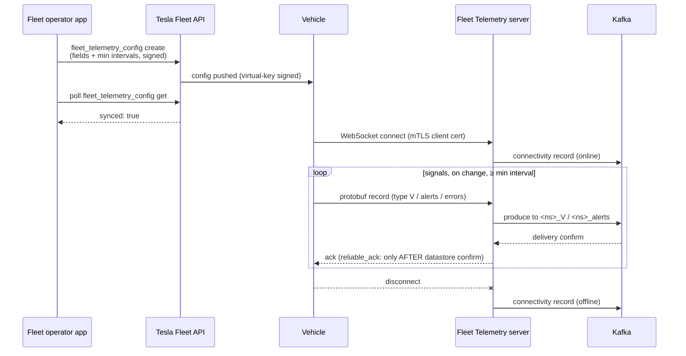
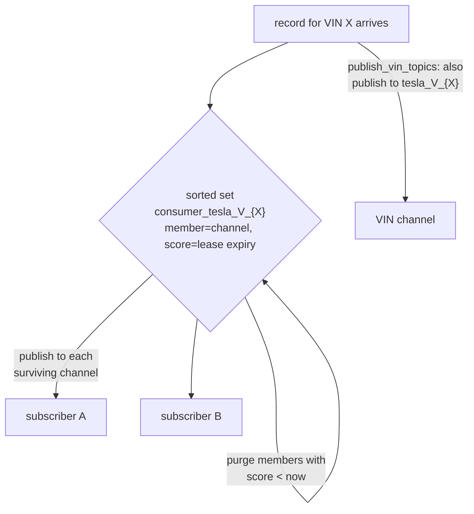

# Fleet Telemetry — Deep Dive (the team's public blueprint)

Source: github.com/teslamotors/fleet-telemetry README (pulled 2026-07-20). This is the
open-source reference implementation of the exact protocol your team's backend consumes.
Interviewer (Umesh) is a Go / distributed-infra person — this repo is written in Go and
speaks his language. Every section ends with what to SAY about it.

---

## 1. The big picture

Recommended production shape straight from the README: **Firewall/LB → Fleet Telemetry →
Kafka**. Topics are `<namespace>_V`, `<namespace>_alerts`, `<namespace>_connectivity`
(default prefix `tesla`).

**Say:** "The server is a thin, stateless-ish ingestion tier: terminate mTLS, validate,
ack, and fan out to pluggable dispatchers. All durable state lives in the message bus.
That's why it scales horizontally on Kubernetes — the README ships a Helm chart."

---

## 2. The four record types

| Record type | What it is | Maps to (team briefing) |
|---|---|---|
| `V` | Vehicle telemetry data — the configured signal fields | telemetry context for root-causing |
| `alerts` | Fault/alert records | the `VCFRONT_a182`-style alerts your team triages |
| `errors` | Client-side telemetry errors | debugging the pipeline itself |
| `connectivity` | Connect/disconnect events | **online-state proxy — 99%+ accurate** |

Each record type gets its own dispatcher list in config — e.g. `V` → kafka+kinesis,
`alerts` → kafka, `errors` → logger. That's per-stream routing in one config block.

**Say:** "Connectivity events double as a vehicle-online signal. For remote diagnostics
that's load-bearing: you check the connectivity stream before triggering a diagnostic,
and if the car's offline you queue and retry instead of failing" — that's failure mode #1
from talking-points, grounded in the actual repo.

---

## 3. Config and connection lifecycle

Key details worth owning:

- **Config is code-signed**: `fleet_telemetry_config` is signed with the app's virtual
  key; signing keys belong offline / in an HSM per the README's security section. A
  vehicle only streams to a server whose config it can verify — you can't hijack a fleet
  by spoofing a config.
- **On-change + min interval**: signals transmit when they change, but never more often
  than the configured interval. Client-side filtering = cellular bandwidth is the scarce
  resource; sample at the edge, not the server.
- **Reliable acks**: with `reliable_ack: true` (recommended with Kafka), the vehicle's
  ack comes only after the durable write. One reliable-ack dispatcher per record type.
  The vehicle retransmits unacked records → **at-least-once delivery**, so downstream
  consumers must be idempotent / dedupe.
- **Rate limiting**: server-side `rate_limit.message_limit` caps messages per connection
  — LC 359 Logger Rate Limiter is literally this feature. Say so if 359-style design
  comes up.

**Say:** "It's an event-driven, at-least-once pipeline: on-change publish from the edge,
durable-write-then-ack, replayable log in the middle. Consumers dedupe. That's the
textbook trade — you accept duplicates to never lose a fault record, because a missed
alert is a missed diagnosis."

---

## 4. The dispatcher abstraction (the part to praise to a Go engineer)

Dispatchers are a producer interface with seven implementations: **Kafka (preferred),
Kinesis, Google Pub/Sub, ZMQ, MQTT, Redis Pub/Sub, STDOUT logger**. Adding one requires
integration tests + docs. `transmit_decoded_records: true` switches the wire format to
dispatchers from protobuf to JSON (convenience vs. size/schema trade).

The Redis dispatcher hides a genuinely interesting distributed-systems pattern —
**lease-based per-VIN subscriptions**:

Subscribers register interest in a VIN with an expiry timestamp as the sorted-set score;
dead subscribers age out automatically on the next publish. No heartbeat service, no
cleanup job — the data structure IS the liveness protocol.

**Say:** "Kafka is preferred because diagnostics wants a durable, replayable, multi-
consumer log — triage, analytics, and alert-history all read the same stream without
coordinating. The Redis path exists for a different shape: low-latency per-vehicle
fan-out, with subscriber liveness done as lease expiries in a sorted set."

---

## 5. Observability (the JD lists it twice)

- **Prometheus** metrics port (or StatsD with sample rate + flush period), reference
  **Grafana dashboard** shipped in the repo's integration tests.
- **Per-signal tracking**: counts per record type, plus opt-in per-VIN signal tracking
  (`vins_signal_tracking_enabled`) — usable for billing AND for coverage ("are we still
  hearing from this car?").
- Structured **JSON logging** (`json_log_enable`), **Airbrake** for exception reporting,
  and a pprof **profiler port** in the monitoring block — a Go-ism worth recognizing.

**Say:** "Tesla's stated data-platform lesson is to track end-to-end freshness and
coverage, not just per-service latency — and you can see it in the reference server:
per-VIN signal counters are a coverage metric at the source. A wrong remote diagnosis
ships the wrong part in a van, so observability is product correctness here."

---

## 6. Security model (defense in depth, their words)

1. Vehicles authenticate with **TLS client certificates** (mTLS terminated at the FT
   service, not at the LB).
2. README explicitly says: assume a vehicle's key CAN be compromised →
   **sanitize server-side**, expect **falsified data** from incentivized actors,
   **VIN allowlist** where possible.
3. Config-signing keys: offline + HSM.
4. Privacy: even without location fields, telemetry allows behavior inference —
   collect only needed fields at needed frequency (data minimization).

**Say:** "The trust boundary is drawn at the vehicle key: authenticated ≠ trusted.
Push raw data fast, sanitize in the cloud — matches Tesla's public data-platform talks.
For diagnostics that means the triage layer validates signal plausibility before acting;
a spoofed alert should never auto-ship a part."

---

## 7. First-principles Q&A drill (rehearse these out loud)

**Q: Why a persistent WebSocket instead of the vehicle POSTing to a REST endpoint?**
Cars sit behind NAT/cellular — the server can't dial in, so the car holds the connection
open. One connection amortizes TLS handshakes over thousands of tiny records (battery +
data cost), server can push acks/rate-limits back on the same socket, and connection
state itself becomes the online-signal for free.

**Q: Why protobuf over JSON?**
~10x smaller on cellular links, schema-enforced at decode time, and numbered fields give
backward-compatible evolution — a 2023 car and a 2026 car can stream to the same server.
JSON is available (`transmit_decoded_records`) but server-side, after the expensive hop.

**Q: What happens when Kafka is down?**
Producer buffers (`queue.buffering.max.messages` ~1M), acks stop flowing when
reliable-ack is on, vehicle stops getting acks and retains/retransmits → backpressure
propagates to the edge instead of losing records. Recovery = at-least-once redelivery;
consumers dedupe. (If asked "and if the buffer fills?" — rate-limit responses and drop
with metrics; you protect the service, never silently.)

**Q: How do you know you're not losing data?**
Reliable acks end-to-end (ack after durable write), plus coverage metrics per record
type/VIN, plus the connectivity stream to distinguish "car offline" from "pipeline
broken" — freshness AND coverage, not just service health.

**Q: How does this scale 10x?**
Stateless ingestion tier → horizontal pods behind the LB (Helm chart provided); Kafka
partitions by VIN preserve per-vehicle ordering while parallelizing; namespace prefixes
isolate pipelines (Tesla's stated lesson: isolate by business unit/model/geo).

---

## 8. One-liner to open with if asked "have you looked at our stack?"

"I read through fleet-telemetry — vehicles hold an mTLS WebSocket and push protobuf
records on-change, and the server is a thin Go ingestion tier that fans out to
per-record-type dispatchers, Kafka preferred, with reliable acks tied to the durable
write. What I liked is how much of the diagnostics problem is already visible in it:
the alerts stream, connectivity as an online proxy, and per-VIN coverage metrics."
